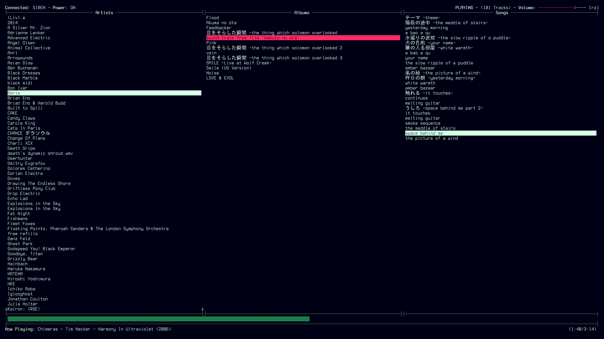

# horizon

A TUI controller for Logitech Media Server

### *This is a work in progress :: Use at your own risk :)*

------------------------------------------------------------------------------

The above images showcase the various screens of _horizon_.

## What is horizon and why does it exist?

_horizon_ is a Terminal User Interface (TUI) meant to control and display
information from a [Logitech Media
Server](https://en.wikipedia.org/wiki/Logitech_Media_Server) (LMS). Users of
[ncmpcpp](https://github.com/ncmpcpp/ncmpcpp) may find the look and feel of
_horizon_ pretty similar, and that is by design. I've used ncmpcpp with mpd
extensively in the past, but recently I've moved to hosting my own music server
using LMS, which means no mpd, and therefore no ncmpcpp.

Luckily, someone went through the trouble of writing a [Python
library](https://github.com/roberteinhaus/lmsquery) that can query the LMS for
information, and even run commands! All you need to provide it is the IP and
Port your LMS is running on, which in most cases you'll know if you've set up
the LMS on your home network.

So I did what I do best -- go overboard by making a TUI just for an app I may
end up discarding in favor of a browser-based option down the road.

## What exactly does it do?

At the moment, you have three screens: The Playlist, the Media Library, and the
Saved Playlists screen.

On the Playlist screen, you can view what the connected player currently has in
its playlist, play selected tracks, toggle play/pause, toggle repeat/shuffle
modes, skip to the previous/next track, change volume, turn the player on and
off, and even select a totally different player to connect to.

In the Media Library, you can navigate between nested lists of artists, albums,
and songs. You can load the selected media into the playlist (which clears out
the playlist and loads the media, then begins playing it), or append the
selected media to the end of the playlist.

On the Saved Playlists screen, you can view your saved playlists, play
individual tracks from any given playlist, or load the entire playlist into the
play queue.

There are still some features I need to add, such as deleting certain items from
the play queue, saving new playlists, deleting saved playlists, renaming saved
playlists, moving and reordering tracks in the play queue and any given saved
playlist, and more.

## How can I run it?

First, you'll need to make sure you have the proper libraries installed. See the
link to `lmsquery` above to find installation instructions for that. Otherwise,
just make sure you have curses for Python.

Then, from the base directory, run `./main.py`

The main file specifies python3.8 due to `lmsquery`, so make sure you have that
version of Python installed.

## How can I configure it?

For right now, configuration is done in the `config.json` file. See the config
file provided in the repository for how to customize it.

## How do I use it?

Here are the commands that exist right now:

### General Commands

These are commands that should work on any screen.

Key | Action
----|-------
<kbd>q</kbd> | quit horizon
<kbd>1</kbd> | open the Playlist screen
<kbd>2</kbd> | open the Media Library screen
<kbd>3</kbd> | open the Saved Playlists screen
<kbd>c</kbd> | clear the current playlist
<kbd>-</kbd> | volume down
<kbd>=</kbd> or <kbd>+</kbd> | volume up
<kbd>o</kbd> | toggle player on/off
<kbd>p</kbd> | pick player to connect to

### Playlist Commands

These are commands that work on the Playlist screen.

Key | Action
----|-------
<kbd>f</kbd> | fetch/reload the current playlist
<kbd>j</kbd> and <kbd>k</kbd> | change track focus up and down
<kbd>J</kbd> and <kbd>K</kbd> | change track focus up and down by half a page
<kbd>g</kbd> and <kbd>G</kbd> | change track focus to top/bottom of list
<kbd>Space</kbd> | toggle play/pause
<kbd>/</kbd> | stop playing
<kbd>\`</kbd> or <kbd>~</kbd> | toggle player mute
<kbd>Enter</kbd> | start playing from highlighted track
<kbd><</kbd> and <kbd>></kbd> | skip to previous/next track in playlist
<kbd>,</kbd> and <kbd>.</kbd> | seek +/- 5 seconds within current track
<kbd>r</kbd> | toggle repeat mode
<kbd>z</kbd> | toggle shuffle mode
<kbd>n</kbd> | rename the currently connected player
<kbd>S</kbd> | save contents of play queue into a new playlist

Note that the repeat and shuffle mode indicators are at the top right of the
screen, and use the following values:
- Repeat
  - '-': No repeat
  - 'r': Repeat single track
  - 'R': Repeat playlist
- Shuffle
  - '-': No shuffle
  - 'z': Shuffle tracks
  - 'Z': Shuffle albums

### Media Library Commands

These are commands that work on the Media Library screen.

Key | Action
----|-------
<kbd>f</kbd> | fetch/reload the media library
<kbd>j</kbd> and <kbd>k</kbd> | change item focus up and down
<kbd>J</kbd> and <kbd>K</kbd> | change item focus up and down by half a page
<kbd>g</kbd> and <kbd>G</kbd> | change item focus to top/bottom of list
<kbd>h</kbd> and <kbd>l</kbd> | change panel focus left and right
<kbd>Enter</kbd> | empty playlist, load highlighted media, and play
<kbd>Space</kbd> | append highlighted media to current playlist

### Saved Playlist Commands

These are commands that work on the Saved Playlists screen.

Key | Action
----|-------
<kbd>f</kbd> | fetch/reload the saved playlists
<kbd>j</kbd> and <kbd>k</kbd> | change item focus up and down
<kbd>J</kbd> and <kbd>K</kbd> | change item focus up and down by half a page
<kbd>g</kbd> and <kbd>G</kbd> | change item focus to top/bottom of list
<kbd>h</kbd> and <kbd>l</kbd> | change panel focus left and right
<kbd>Enter</kbd> | empty playlist, load highlighted media, and play
<kbd>Space</kbd> | append highlighted media to current playlist
<kbd>n</kbd> | rename highlighted playlist

## Now what?

Use it as it exists now, wait for more updates, I don't know. It's open source
code I spill out in my free time, do whatever the heck you want with it. :)
